# IT Infrastructure & DevOps Trainee Assignment

A multi-service infra project: hardened Ubuntu host, Dockerized Nginx + Flask +
PostgreSQL stack, automated health checks, and database backup/restore.

---

## Repo layout

```
.
├── app/
│   ├── app.py                   # Flask backend
│   ├── requirements.txt
│   └── Dockerfile
├── db/
│   └── init.sql                 # seeds a 'todos' table on first startup
├── nginx/
│   └── default.conf             # reverse proxy config
├── scripts/
│   ├── infra_health_check.sh    # CPU/RAM/disk + container checks, cron target
│   ├── db_backup.sh             # pg_dump -> gzip -> /var/backups/db/
│   └── install_cron.sh          # installs both cron jobs
├── docker-compose.yml            # nginx + app + db stack
├── .env.example
└── README.md
```

---

## Environment

- **Host machine:** Fedora (running libvirt / QEMU-KVM)
- **Guest VM:** Ubuntu 26.04.1 LTS, managed via `virsh` / virt-manager
- All provisioning below is done by hand, inside the Ubuntu guest

Find the VM's IP once it's up:

```bash
virsh domifaddr <vm-name>
# or, from inside the guest:
ip a
```

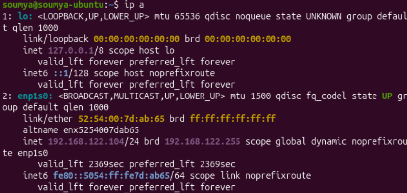

The IP address of my Ubuntu machine is `192.168.122.104`, as shown in the
`inet` section.

---

## Part 1: System Provisioning & Linux Administration

### Install SSH server on Ubuntu VM

```bash
sudo apt update
sudo apt install openssh-server
sudo systemctl enable --now ssh
```

Check if the SSH server is running using:

```bash
sudo systemctl status ssh
```

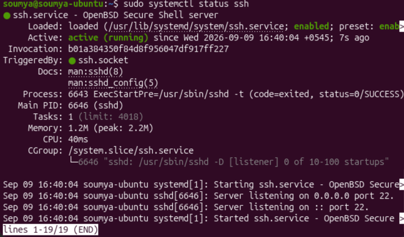

### 1. Generate an SSH key (on the host, if you don't have one already)

```bash
ssh-keygen -t ed25519 -C "trainee@devops-assignment"
```

SSH keys are present in `~/.ssh`:

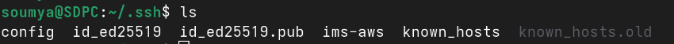

`id_ed25519` -> This is the private key  
`id_ed25519.pub` -> This is the public key

### 2. Create the trainee user and add to the sudo group (inside the Ubuntu guest)

```bash
sudo adduser trainee
sudo usermod -aG sudo trainee
```

`adduser` will prompt for a password and GECOS details (full name, room
number, etc.) interactively. I have set the password but skipped the GECOS
details.

To see details of a user, use the following command:

```bash
id trainee #trainee is the username
```

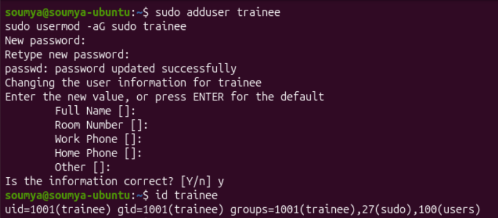

Change user using:

```bash
sudo su trainee
```

### 3. Copy your public key to the new user

From the Fedora host:

```bash
ssh-copy-id -p 22 -i ~/.ssh/id_ed25519.pub trainee@<vm-ip>
```

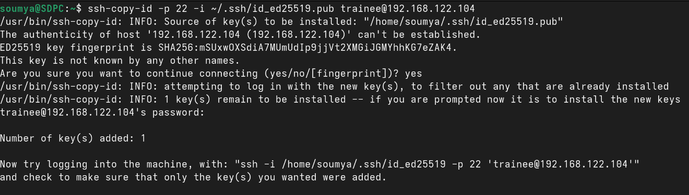

#### Quick sanity check to see if the key was added to Ubuntu

In Ubuntu, run:

```bash
cat ~/.ssh/authorized_keys
```

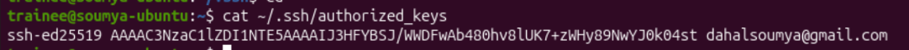

My Fedora's public key is here, so it's all good.

### 4. Confirm key-based login works on port 22 BEFORE hardening

```bash
ssh -p 22 trainee@<vm-ip>
```

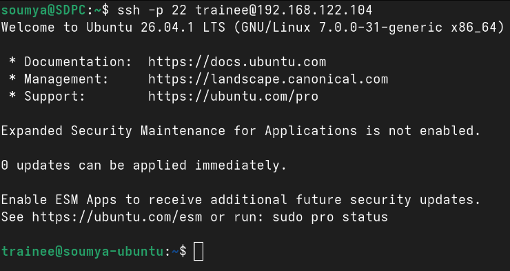

I can log in without a password prompt, so it is working fine.

### 5. Harden SSH (disable root login, disable password auth, and move to port 2222)

Inside Ubuntu, edit `/etc/ssh/sshd_config`, which is the SSH config file:

```bash
sudo vi /etc/ssh/sshd_config
```

Set (add or uncomment) these directives:

```
Port 2222
PermitRootLogin no
PasswordAuthentication no
PubkeyAuthentication yes
```

Validate the config, then restart SSH:

```bash
sudo sshd -t
sudo systemctl restart ssh
```

**Keep your current SSH session (on port 22) open.** In a second terminal on
the Fedora host, test the new connection before closing the first one:

```bash
ssh -p 2222 trainee@<vm-ip>
```

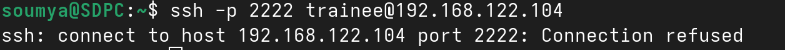

This does not work on Ubuntu 22.04 and later (including 26.04), because SSH
is often socket-activated by systemd, which means systemd (not sshd itself)
listens on the port and hands off connections. So we must disable socket
activation and let sshd manage the port itself.

```bash
sudo systemctl stop ssh.socket
sudo systemctl disable ssh.socket
sudo systemctl enable ssh.service
sudo systemctl restart ssh.service
```

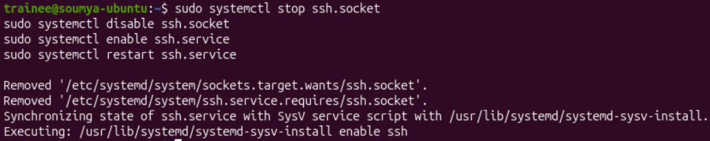

Now, run again:

```bash
ssh -p 2222 trainee@<vm-ip>
```

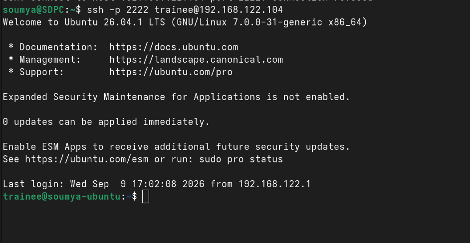

### 6. Configure the firewall (UFW)

We want to configure a firewall rule such that we deny all incoming requests
to the Ubuntu machine except TCP on port 2222 for SSH, TCP on port 80 for
HTTP, and TCP on port 443 for HTTPS. We will use UFW (Uncomplicated
Firewall) as our firewall service for Ubuntu. We also need to make sure not
to allow TCP connections to port 22 for SSH, which is the default SSH port.
Run the following commands to install, set up, and enable UFW to configure
the discussed settings.

```bash
sudo apt update && sudo apt install -y ufw
sudo ufw default deny incoming
sudo ufw default allow outgoing
sudo ufw allow 2222/tcp comment 'SSH (custom port)'
sudo ufw allow 80/tcp comment 'HTTP'
sudo ufw allow 443/tcp comment 'HTTPS'
sudo ufw delete allow 22/tcp 2>/dev/null || true
sudo ufw delete allow ssh 2>/dev/null || true
sudo ufw enable
```

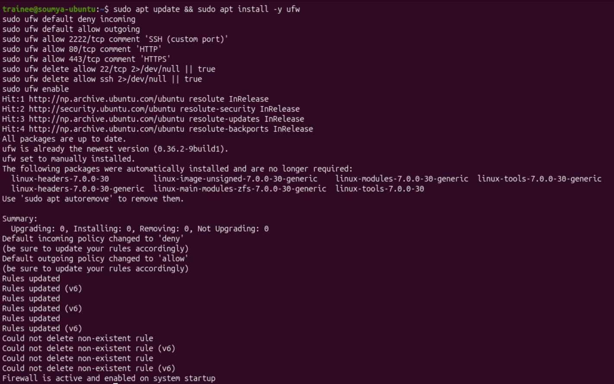

### Verify Part 1

Verify the firewall rules:

```bash
sudo ufw status verbose
```

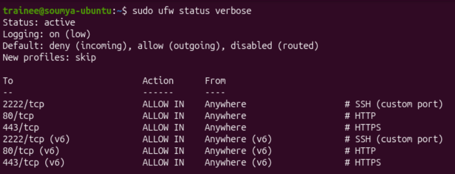

Verify the SSH rules:

```bash
sudo sshd -T | grep -E "^(port|permitrootlogin|passwordauthentication) "
```

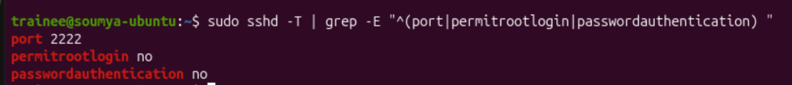

After this, we will not use our Ubuntu machine directly — we will SSH into
it from our Fedora host.

---

## Part 2: Containerization & Web Services

### Development workflow: on the Fedora host

We will develop a simple Python app using Flask and Postgres for
demonstration purposes. I will be using my Fedora host for development,
with proper commits in Git.

The app will be a simple todo app with a minimal database schema having a
single table named `todos` with attributes id (pk), title, content, and
created_at.

The app will be behind a reverse proxy (nginx), so the architecture will be:


I will develop on Fedora and deploy on the Ubuntu guest. Hence, push from
Fedora, pull on the VM.

**On Fedora**

Build the app and the infra stack, test it locally, and push to GitHub. The
app and infra structure is:

```
.
├── app/
│   ├── app.py                   # Flask backend
│   ├── requirements.txt
│   └── Dockerfile
├── db/
│   └── init.sql                 # seeds a 'todos' table on first startup
├── nginx/
│   └── default.conf             # reverse proxy config
│
├── docker-compose.yml            # nginx + app + db stack
├── .env.example
```

I have written all the code for the app and infrastructure.

Let's test the app to see if everything is working correctly. Go to the
project root and run:

```bash
cp .env.example .env
vi .env # Set a real POSTGRES_PASSWORD
```

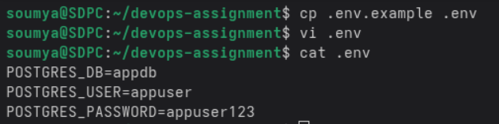

Now build the Docker image:

```bash
docker compose up -d --build
```

Now run:

```bash
docker ps
```

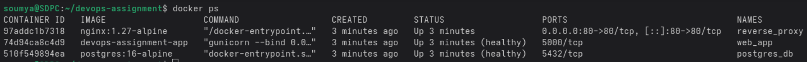

We see 3 containers running: nginx (reverse proxy), the Flask app, and the
Postgres database — which is exactly what we want.

Now, in a browser, go to `http://127.0.0.1`

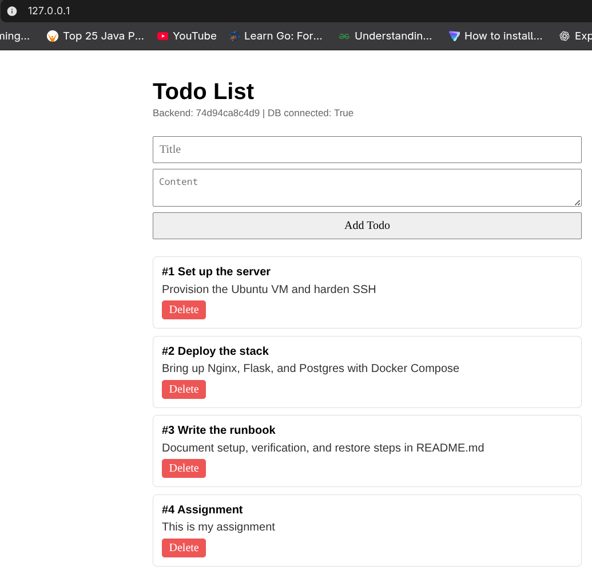

As we can see, the app is running perfectly on my Fedora, so now I will
initialize a Git repository in this project root, make commits, and push it
to a GitHub repo.

### Deployment workflow: on the Ubuntu VM

### 1. Install Docker, Docker Compose, and Git (if not already installed)

```bash
ssh -p 2222 trainee@<vm-ip>
sudo apt install git
curl -fsSL https://get.docker.com | sudo sh
sudo usermod -aG docker trainee
# log out and back in for the group change to take effect
```

### 2. Clone the GitHub repository and configure environment variables

```bash
git clone https://github.com/Soumya-Dahal/todo-assignment.git
cd todo-assignment
cp .env.example .env
vi .env   # set a real POSTGRES_PASSWORD
```

### 3. Build and start the stack

```bash
docker compose up -d --build
```

This is the same thing that we did on our development machine (Fedora).
Also run:

```bash
docker ps
```

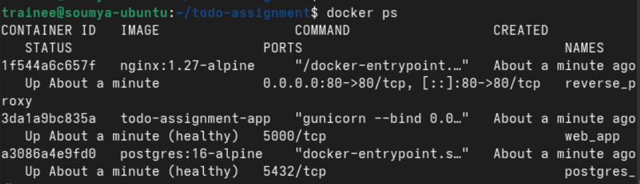

The three containers are running as expected.

### 4. Verify

```bash
curl http://localhost/api/todos
```

Also, make an HTTP request into the VM using a web browser on the host
(Fedora).

`http://192.168.122.104`

192.168.122.104 is the IP address of the Ubuntu VM.

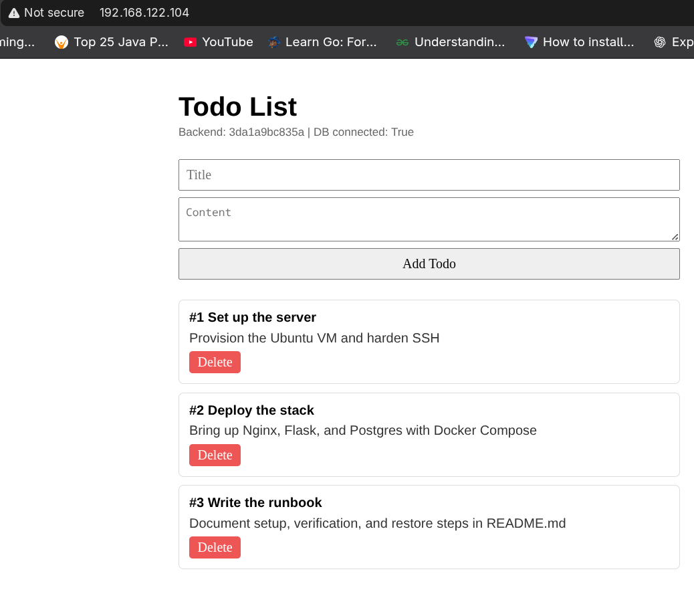

### Teardown

```bash
docker compose down          # stop and remove containers, keep the db_data volume
docker compose down -v       # also delete the persistent volume (destroys DB data)
```

---

## Part 3: Automation & health checks

Follow the same workflow as in Part 2 — write and test the scripts on the
Fedora host, push to GitHub, and then pull on the Ubuntu VM.

Create the following:

```
├── scripts/
│   ├── infra_health_check.sh    # CPU/RAM/disk + container checks, cron target
│   ├── db_backup.sh             # pg_dump -> gzip -> /var/backups/db/
│   └── install_cron.sh          # installs both cron jobs
```

### Install the health-check script + cron job

```bash
sudo bash scripts/install_cron.sh
```

This copies `infra_health_check.sh` and `db_backup.sh` into `/opt/scripts/`,
and installs two cron entries:

| Job | Schedule | Purpose |
|---|---|---|
| `infra_health_check.sh` | every 15 minutes (`*/15 * * * *`) | CPU/RAM/disk + container status |
| `db_backup.sh` | daily at 02:00 (`0 2 * * *`) | database dump + retention cleanup |

### Verify

```bash
sudo crontab -l
sudo bash /opt/scripts/infra_health_check.sh   # run once manually
cat /var/log/infra_health.log                  # check for [WARNING] entries
```

Note that we are using root's crontab because we need root privileges to
access and modify files in `/opt` and `/var`.

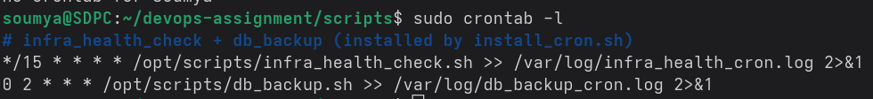

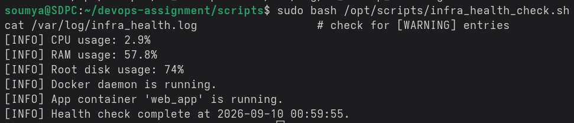

After verifying, commit and push to GitHub. On the Ubuntu VM, pull the
changes and repeat the same steps (install the health-check script + cron
job, and verify).

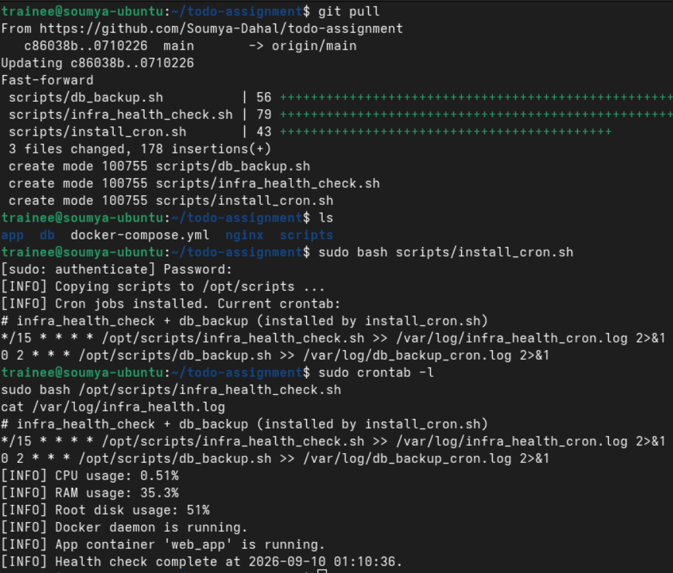


**Thresholds:** the script logs a `[WARNING]` line to
`/var/log/infra_health.log` when root disk usage exceeds **85%**, or when the
`web_app` container is not in a `running` state.

---

## Part 4: Backups & disaster recovery

### Run a backup manually

The `todos` table is seeded with 3 rows on first startup (`db/init.sql`),
and grows as you add items through the app (either the web form at `/` or
`POST /api/todos`), so there's always real data to back up, not an empty
database. Database backups happen every day at 02:00 as defined in the cron
job (`0 2 * * *`). For verification purposes, we can run the script
manually.

```bash
sudo bash /opt/scripts/db_backup.sh
ls -lh /var/backups/db/
```

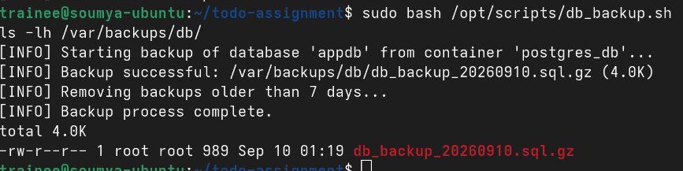

As we can see, a compressed backup of the database is made
(`db_backup_20260910.sql.gz`).

Backups older than 7 days are pruned automatically (see `RETENTION_DAYS` in
`db_backup.sh`).

### Restore procedure (disaster recovery)

```bash
# Option A: pipe directly into the running container
gunzip -c /var/backups/db/db_backup_YYYYMMDD.sql.gz | \
  docker exec -i postgres_db psql -U appuser -d appdb

# Option B: decompress first, then restore
gunzip -k /var/backups/db/db_backup_YYYYMMDD.sql.gz
docker exec -i postgres_db psql -U appuser -d appdb < db_backup_YYYYMMDD.sql

# Verify tables restored
docker exec -it postgres_db psql -U appuser -d appdb -c '\dt'
docker exec -it postgres_db psql -U appuser -d appdb -c 'SELECT count(*) FROM todos;'
```

If restoring into a completely fresh database (e.g. after `docker compose
down -v`), start the stack first so a blank `appdb` exists, then run the
restore command above.

---
